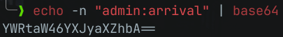
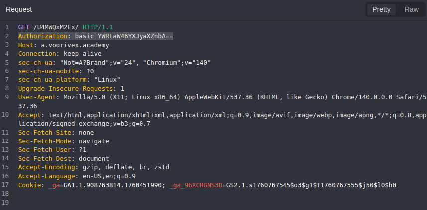
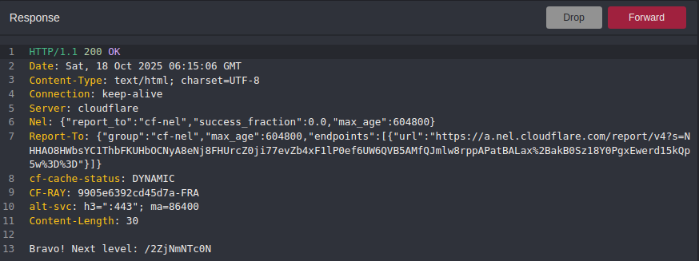

#  📌 Challenge Overview

| 🧩 Platform & Name | Arrival-VoorivexAcademy/lvl9 |
| ------------------ | ---------------------------- |
| 📅 Date            | 2025-10-18                   |
| 👾 Solver          | Ph4nt01                      |
| 🔰 Category        | web                          |
| ⭐ Difficulty       | easy                         |

---

# 📋 Initial Info:

### 

---

# 🔍 Initial Analysis:

### - we should probably send the get request with basic authorization header to get the flag

---

# 🔓 Solving

### - first we should make a base64 string from `admin=arrival`, i did it via `base64` command
### 
### - then we add the auth header in the request and forward it
### 
### 

---

```markdown

🚩 Flag -> `/2ZjNmNTc0N`

```

---
