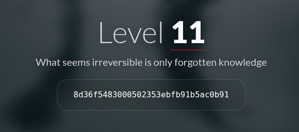
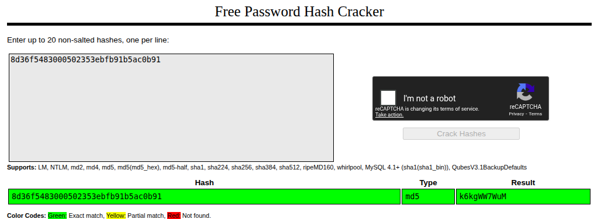

#  📌 Challenge Overview

| 🧩 Platform & Name | Arrival-VoorivexAcademy/lvl11 |
| ------------------- | ------------------------------- |
| 📅 Date             | 2025-10-18 |
| 👾 Solver           | Ph4nt01 |
| 🔰 Category         | crypto |
| ⭐ Difficulty        | easy |

---

# 📋 Initial Info:

### 

---

# 🔍 Initial Analysis:

### - we must decrypt the hash to get the flag

---

# 🔓 Solving

### - i used [crackstation](https://crackstation.net/) to decrypt the hash
### 

---

```markdown

🚩 Flag -> `/k6kgWW7WuM`

```

---
