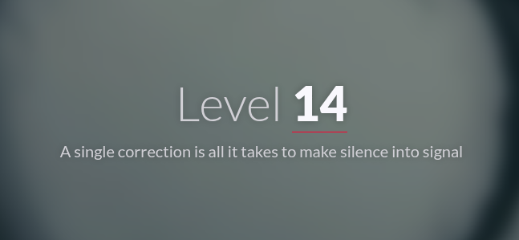
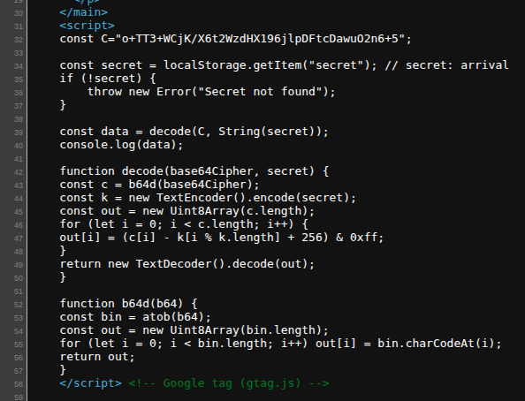
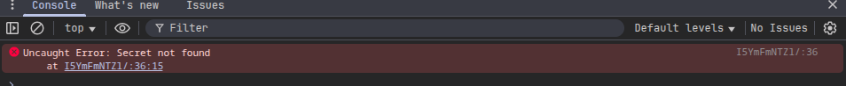
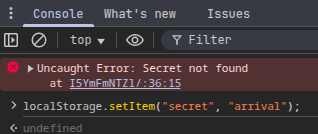
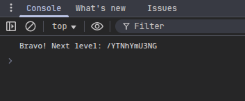
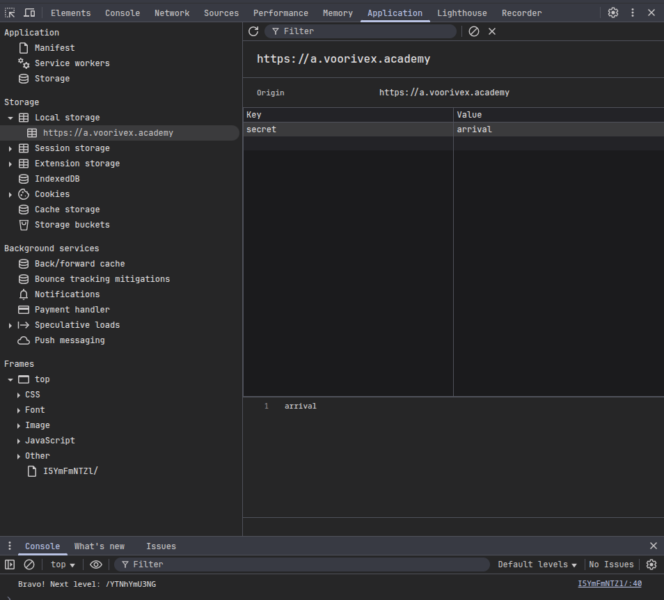

#  📌 Challenge Overview

| 🧩 Platform & Name | Arrival-VoorivexAcademy/lvl14 |
| ------------------- | ------------------------------- |
| 📅 Date             | 2025-10-18 |
| 👾 Solver           | Ph4nt01 |
| 🔰 Category         | web |
| ⭐ Difficulty        | medium |

---

# 📋 Initial Info:

### 

---

# 🔍 Initial Analysis:

### - in the source code we can see a script which expects the key "secret" in localstorage to be "arrival".
### 
### - if we chack the browser console we can see the error which indicates `secret: arrival` is not in the localstorage and the script won't run properly because of that
### 

---

# 🔓 Solving

### - to add key `secret` to be `arrival` in the localstorage, we can run the command `localStorage.setItem("secret", "arrival");` in the browser console; which gave us the flag
### 
### 
### - or we can manually add the key & value to the localstorage using browser dev tool
### 

---

```markdown

🚩 Flag -> `/YTNhYmU3NG`

```

---
