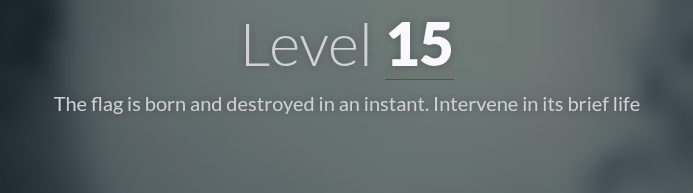
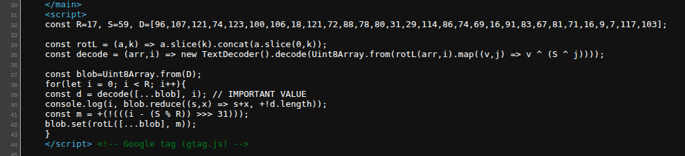
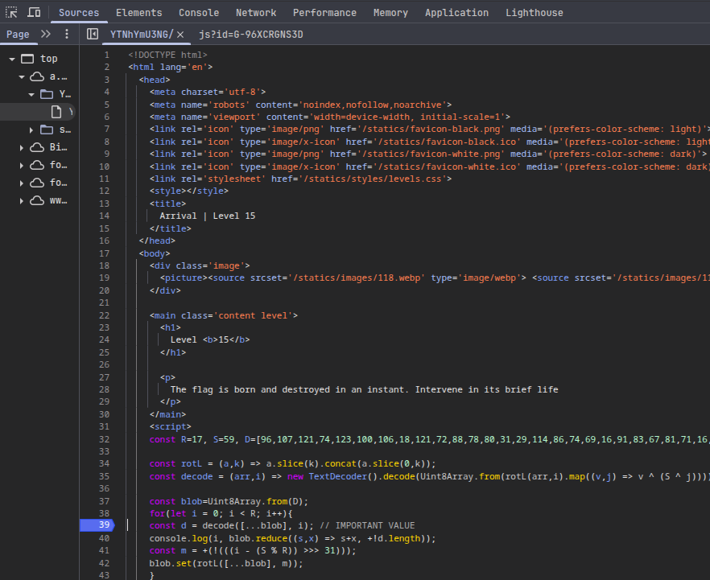
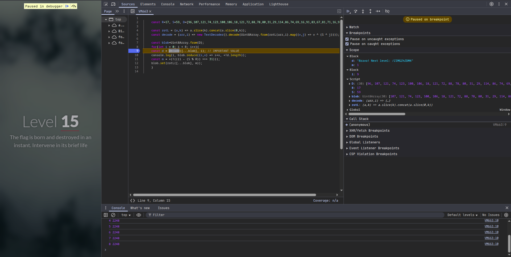

#  📌 Challenge Overview

| 🧩 Platform & Name | Arrival-VoorivexAcademy/lvl15 |
| ------------------- | ------------------------------- |
| 📅 Date             | 2025-10-18 |
| 👾 Solver           | Ph4nt01 |
| 🔰 Category         | web |
| ⭐ Difficulty        | easy |

---

# 📋 Initial Info:

### 

---

# 🔍 Initial Analysis:

### - checking the source code, i saw a script
### 
### - "The flag is born and destroyed in an instant. Intervene in its brief life" based on this text, we understand that the flag is shown and removed somewhere in the middle of this script
### - and the part with "IMPORTANT VALUE" comment is probabley where we can find the flag

---

# 🔓 Solving

### - we put the breakpoint at that line, and refresh the site
### 
### - then we resume script execution untill we find the flag
### 

---

```markdown

🚩 Flag -> `/ZIMGZhZDM4`

```

---
