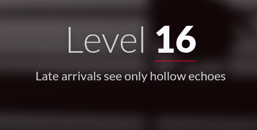
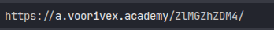
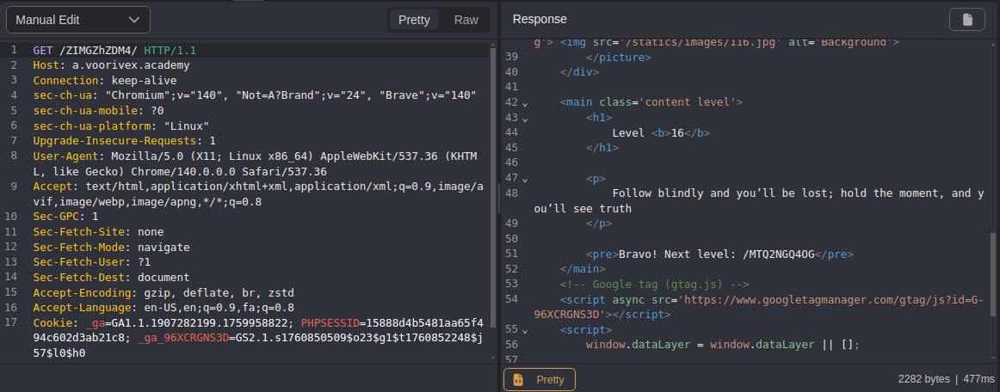

#  📌 Challenge Overview

| 🧩 Platform & Name | Arrival-VoorivexAcademy/lvl16 |
| ------------------- | ------------------------------- |
| 📅 Date             | 2025-10-19 |
| 👾 Solver           | Ph4nt01 |
| 🔰 Category         | web |
| ⭐ Difficulty        | easy |

---

# 📋 Initial Info:

### 

---

# 🔍 Initial Analysis:

### - when looking at the URL we can see that one letter is different from the flag we entered
### 
### - it should be `/ZIMGZhZDM4` instead of `/ZlMGZhZDM4`, but when we change the `l` into `I` it redirects us to the same page

---

# 🔓 Solving

### - in caido i intercept the traffic and manually send the get request to `/ZIMGZhZDM4` and the flag is shown
### 

---

```markdown

🚩 Flag -> `/MTQ2NGQ4OG`

```

---
