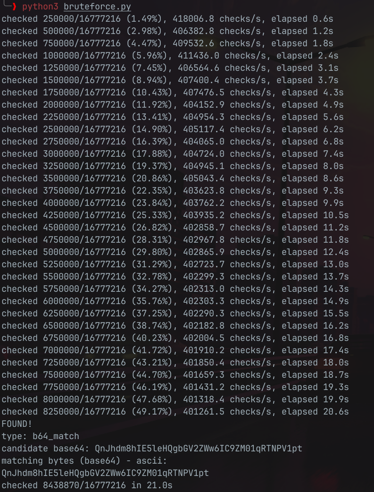
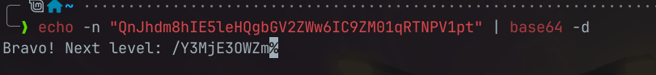

#  📌 Challenge Overview

| 🧩 Platform & Name | Arrival-VoorivexAcademy/lvl19 |
| ------------------- | ------------------------------- |
| 📅 Date             | 2025-10-19 |
| 👾 Solver           | Ph4nt01 |
| 🔰 Category         | crypto |
| ⭐ Difficulty        | medium |

---

# 📋 Initial Info:

### 

---

# 🔍 Initial Analysis:

### - we are given the encoded message: `QnJhdm8hIE5leHQ?bGV2ZWw6IC9Z?01q?TNP?1pt`and the MD5 checksum: `28f09edf0014c017f06f799e7bda9f79`
### - the encoded message is base64 but has four characters missing and replaced by `?`
### - now we must write a script to brute force the four missing characters with `A-Z`, `a-z`, `0-9`, `+` and `/` then each time makes the MD5 hash and check it with the given MD5 checksum and find the correct match

---

# 🔓 Solving

```python
#!/usr/bin/env python3
# solve_b64_bruteforce.py
import base64, hashlib, itertools, sys, time

# corrupted string and target MD5 from the challenge
corrupted = "QnJhdm8hIE5leHQ?bGV2ZWw6IC9Z?01q?TNP?1pt"
target_md5 = "28f09edf0014c017f06f799e7bda9f79"

# base64 alphabet (no '=' padding character, only the 64 symbols)
b64_chars = "ABCDEFGHIJKLMNOPQRSTUVWXYZabcdefghijklmnopqrstuvwxyz0123456789+/"

# precompute the positions of the question marks to speed substitution
qm_positions = [i for i, ch in enumerate(corrupted) if ch == '?']
fixed_chars = list(corrupted)

def md5_hex(b: bytes) -> str:
    return hashlib.md5(b).hexdigest()

def try_candidate(candidate_bytes_b64: bytes):
    """
    candidate_bytes_b64: the bytes of the full base64 string
    Try to decode; if decode succeeds, compute md5 of decoded bytes and compare.
    Also (optionally) compute md5 of the base64 bytes themselves and compare.
    Returns (decoded_text_or_none, reason_string) if match found; else None.
    """
    # First, attempt base64 decode
    try:
        decoded = base64.b64decode(candidate_bytes_b64, validate=True)
    except Exception:
        return None

    # 1) Check MD5 of decoded bytes (likely the intended fingerprint)
    if md5_hex(decoded) == target_md5:
        try:
            text = decoded.decode('utf-8', errors='replace')
        except Exception:
            text = None
        return ("decoded_match", text, decoded)

    # 2) (Optional) Check MD5 of the base64 bytes themselves
    if md5_hex(candidate_bytes_b64) == target_md5:
        return ("b64_match", candidate_bytes_b64.decode('ascii'), candidate_bytes_b64)

    return None

def main():
    start = time.time()
    total = 64 ** len(qm_positions)
    checked = 0
    # We'll iterate over cartesian product of replacement characters
    for combo in itertools.product(b64_chars, repeat=len(qm_positions)):
        checked += 1
        # apply combo to fixed_chars copy
        s_chars = fixed_chars[:]  # shallow copy list of characters
        for pos, ch in zip(qm_positions, combo):
            s_chars[pos] = ch
        candidate = "".join(s_chars)
        candidate_b = candidate.encode('ascii')

        res = try_candidate(candidate_b)
        if res:
            kind, printable, raw = res
            elapsed = time.time() - start
            print("FOUND!")
            print("type:", kind)
            print("candidate base64:", candidate)
            if kind == "decoded_match":
                print("decoded (utf-8):")
                print(printable)
                print("raw bytes (hex):", raw.hex())
            else:
                print("matching bytes (base64) - ascii:")
                print(printable)
            print(f"checked {checked}/{total} in {elapsed:.1f}s")
            return

        # progress print every 250k tries (adjust as you like)
        if checked % 250_000 == 0:
            elapsed = time.time() - start
            rate = checked / elapsed if elapsed > 0 else 0
            print(f"checked {checked}/{total} ({checked/total:.2%}), {rate:.1f} checks/s, elapsed {elapsed:.1f}s")

    print("No match found.")
    print("Total checked:", checked)

if __name__ == "__main__":
    main()
```

### - this python script finds the correct base64 string and prints it
### 
### - then we decode it using the `base64 -d` command and sucessfully get the flag
### 

---

```markdown

🚩 Flag -> `/Y3MjE3OWZm`

```

---
