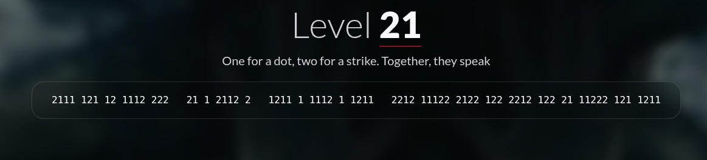
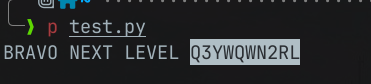

#  📌 Challenge Overview

| 🧩 Platform & Name | Arrival-VoorivexAcademy/lvl21 |
| ------------------- | ------------------------------- |
| 📅 Date             | 2025-10-19 |
| 👾 Solver           | Ph4nt01 |
| 🔰 Category         | crypto |
| ⭐ Difficulty        | easy |

---

# 📋 Initial Info:

### 

---

# 🔍 Initial Analysis:

### - based on the description, we can easily know that this is a morse code

---

# 🔓 Solving

### - we should convert the nums into morse code and decode the morse code to get the flag
### - we can achieve this with this python script

```python
MORSE = {
 'A':'.-', 'B':'-...', 'C':'-.-.', 'D':'-..', 'E':'.', 'F':'..-.',
 'G':'--.', 'H':'....', 'I':'..', 'J':'.---', 'K':'-.-', 'L':'.-..',
 'M':'--', 'N':'-.', 'O':'---', 'P':'.--.', 'Q':'--.-', 'R':'.-.',
 'S':'...', 'T':'-', 'U':'..-', 'V':'...-', 'W':'.--', 'X':'-..-',
 'Y':'-.--', 'Z':'--..',
 '0':'-----','1':'.----','2':'..---','3':'...--','4':'....-',
 '5':'.....','6':'-....','7':'--...','8':'---..','9':'----.'
}
# invert mapping
M2A = {v:k for k,v in MORSE.items()}

s = "2111 121 12 1112 222   21 1 2112 2   1211 1 1112 1 1211   2212 11122 2122 122 2212 122 21 11222 121 1211"

# convert digits to morse
s_morse = s.replace('1', '.').replace('2', '-')

words = [w.strip() for w in s_morse.split('   ')]
decoded_words = []
for w in words:
    letters = w.split()
    decoded = ''.join(M2A.get(letter, '?') for letter in letters)
    decoded_words.append(decoded)

print(' '.join(decoded_words))
```

### 

---

```markdown

🚩 Flag -> `/Q3YWQWN2RL`

```

---
