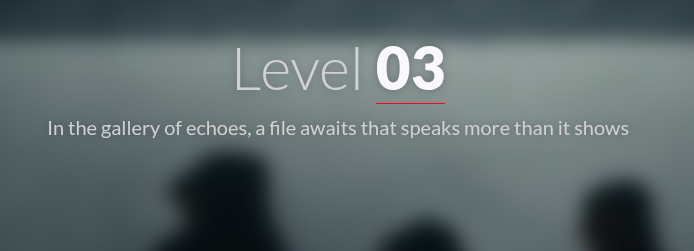
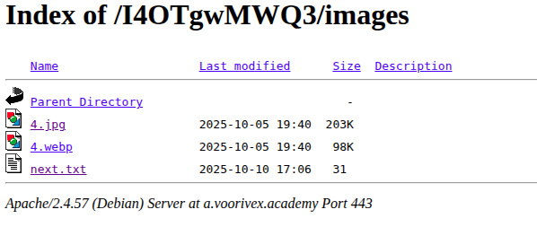
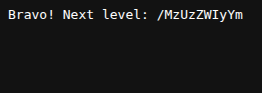

#  📌 Challenge Overview

| 🧩 Platform & Name | Arrival-VoorivexAcademy/lvl3 |
| ------------------- | ------------------------------- |
| 📅 Date             | 2025-10-12 |
| 👾 Solver           | Ph4nt01 |
| 🔰 Category         | web |
| ⭐ Difficulty        | easy |

---

# 📋 Initial Info:

### 

---

# 🔍 Initial Analysis:

### - again the first thing we do is to check the source code
### - since it mentioned gallery and a special file(the flag most likely), we should check out the image address in the source code [https://a.voorivex.academy/I4OTgwMWQ3/images/4.jpg]

---

# 🔓 Solving:

### - nothing special in the image itself, but since it said gallery we should check the ./images/ directory
### - we see a file named next.txt here which contains a flag
### 
### 

---

```markdown

🚩 Flag -> `/MzUzZWIyYm`

```

---
