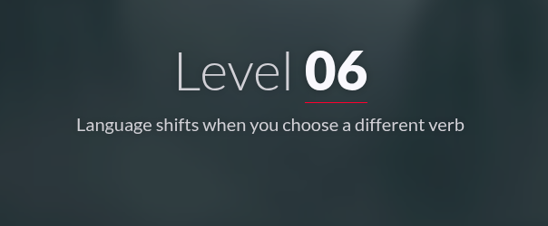
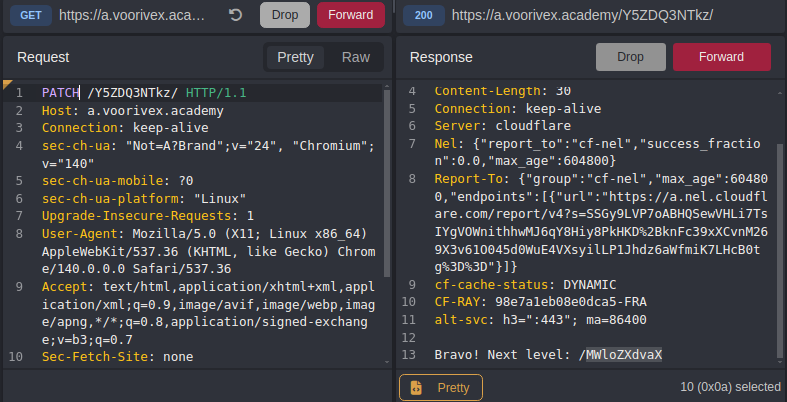

#  📌 Challenge Overview

| 🧩 Platform & Name | Arrival-VoorivexAcademy/lvl6 |
| ------------------- | ------------------------------- |
| 📅 Date             | 2025-10-12 |
| 👾 Solver           | Ph4nt01 |
| 🔰 Category         | web |
| ⭐ Difficulty        | easy |

---

# 📋 Initial Info:

### 

---

# 🔍 Initial Analysis:

### - after checking out the source code and inspecting differente sections, found nothing special
### - decided to open caido(burp alternatinve) for further inspection and sending custom requests
### - since it hints that changing a verb would gives us what we need, we probalbly should change the request method

---

# 🔓 Solving

### - after trying a few methods i tried `PATCH` which gave me the flag
### 

---

```markdown

🚩 Flag -> `/MWloZXdvaX`

```

---

