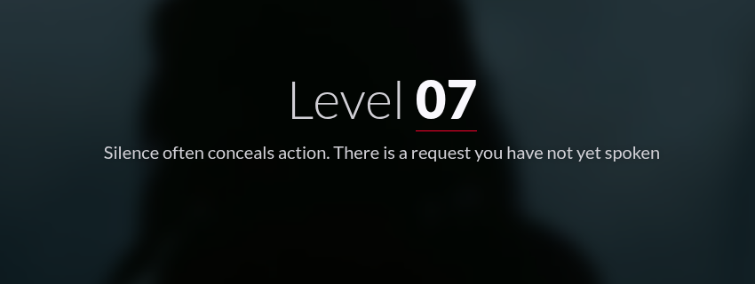
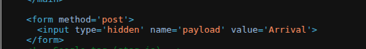
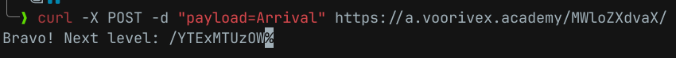
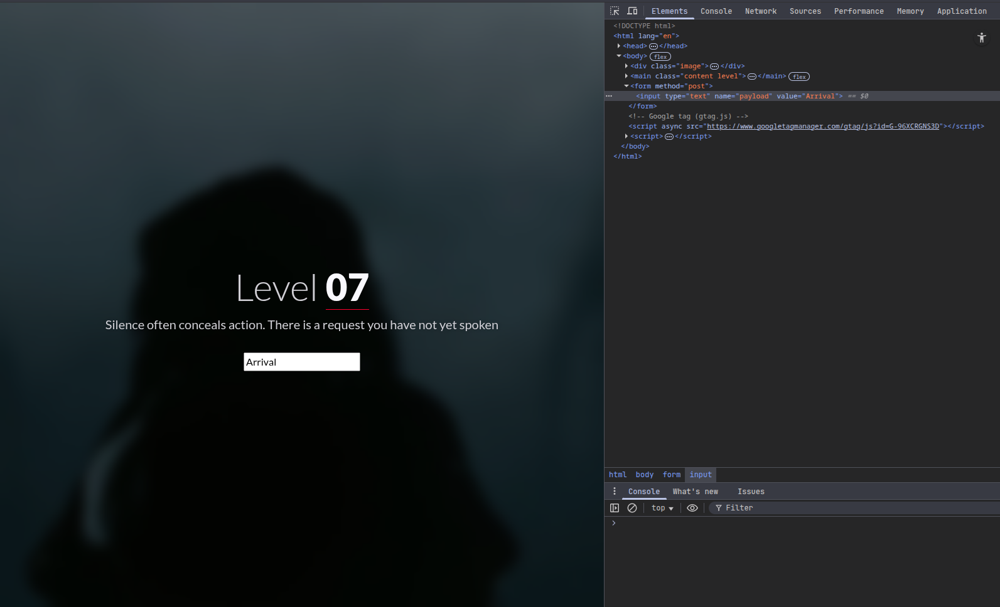

#  📌 Challenge Overview

| 🧩 Platform & Name | Arrival-VoorivexAcademy/lvl7 |
| ------------------- | ------------------------------- |
| 📅 Date             | 2025-10-14 |
| 👾 Solver           | Ph4nt01 |
| 🔰 Category         | web |
| ⭐ Difficulty        | easy |

---

# 📋 Initial Info:

### 

---

# 🔍 Initial Analysis:

### - well its telling us we must send it a certain request to find out the flag
### - after checking out the source code i saw a "hidden" form field
### 

---

# 🔓 Solving

### - using curl, sent a `POST` request with the form field's `name=value` and it gave me the flag
### 

### - this flag can be achieved with an easier way, we can change the field's input type from `hidden` to `text` then press enter to get the flag
### 
### 
---

```markdown

🚩 Flag -> `/YTExMTUzOW`

```

---
