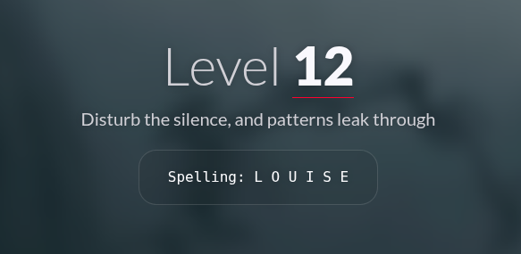
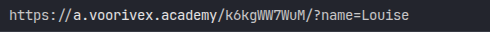
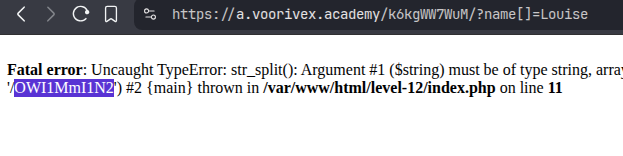

#  📌 Challenge Overview

| 🧩 Platform & Name | Arrival-VoorivexAcademy/lvl12 |
| ------------------- | ------------------------------- |
| 📅 Date             | 2025-10-18 |
| 👾 Solver           | Ph4nt01 |
| 🔰 Category         | web |
| ⭐ Difficulty        | medium |

---

# 📋 Initial Info:

### 

---

# 🔍 Initial Analysis:

### - in this level the URL is different
### 
### - we should convert `name` parameter into an array, and send value of `Louise` or anything else as a array instead of a string

---

# 🔓 Solving

### - if we put brackets([]) in front of `?name`, `Louise` is sent to the server as a array but the server expects string so it causes a stack trace error which shows us the flag
### 

---

```markdown

🚩 Flag -> `/OWI1MmI1N2`

```

---
