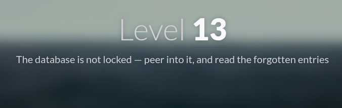
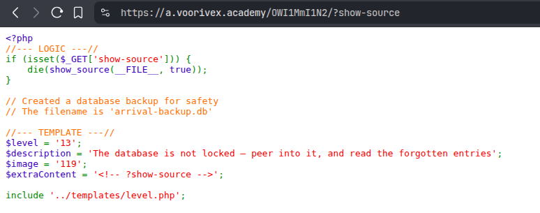
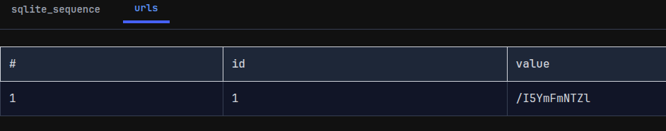

#  📌 Challenge Overview

| 🧩 Platform & Name | Arrival-VoorivexAcademy/lvl13 |
| ------------------- | ------------------------------- |
| 📅 Date             | 2025-10-18 |
| 👾 Solver           | Ph4nt01 |
| 🔰 Category         | web |
| ⭐ Difficulty        | easy |

---

# 📋 Initial Info:

### 

---

# 🔍 Initial Analysis:

### - in the source code i saw the comment `?show-source`
### 
### - so i enter it in address bar and it gave me the data base file name, which i assume the flag is in it
### 

---

# 🔓 Solving

### - i download the database file from `https://a.voorivex.academy/OWI1MmI1N2/arrival-backup.db`
### - viewed the database file in an online tool named [SQLite Reader](https://sqlitereader.com/) and the flag was right there
### 

---

```markdown

🚩 Flag -> `/I5YmFmNTZl`

```

---
