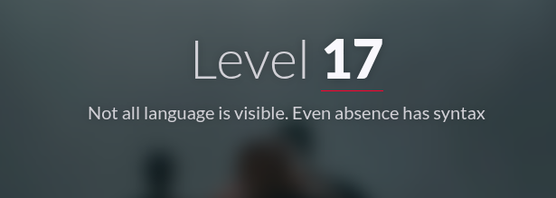
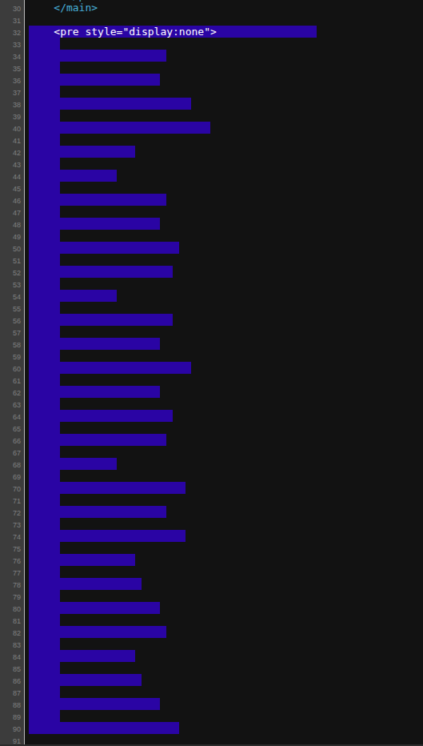
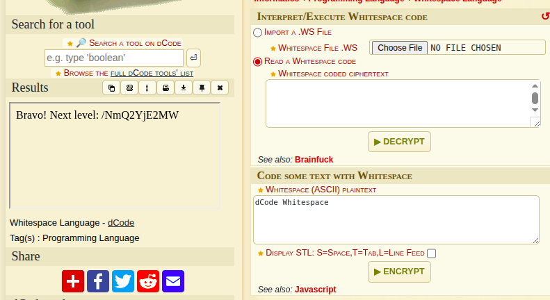

#  📌 Challenge Overview

| 🧩 Platform & Name | Arrival-VoorivexAcademy/lvl17 |
| ------------------- | ------------------------------- |
| 📅 Date             | 2025-10-19 |
| 👾 Solver           | Ph4nt01 |
| 🔰 Category         | web |
| ⭐ Difficulty        | easy |

---

# 📋 Initial Info:

### 

---

# 🔍 Initial Analysis:

### - the site description and a bunch of spaces in the source code, indicates that these spaces mean something
### 
### - after googling a bit, apperantly there is a coding language named "Whitespace language" :|

---

# 🔓 Solving

### - to decode it, i used a online tool ([dcode](https://www.dcode.fr/whitespace-language)) and got the flag
### 

---

```markdown

🚩 Flag -> `/NmQ2YjE2MW`

```

---
