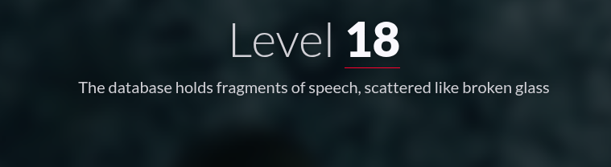
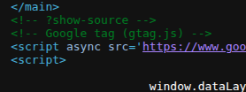
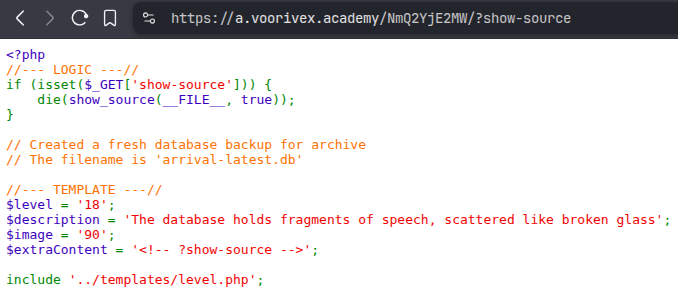
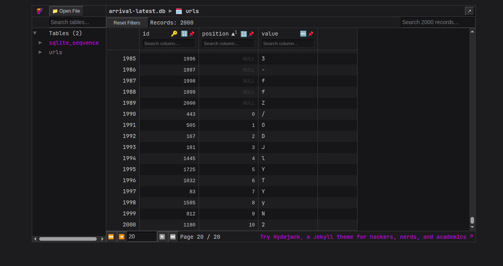

#  📌 Challenge Overview

| 🧩 Platform & Name | Arrival-VoorivexAcademy/lvl18 |
| ------------------- | ------------------------------- |
| 📅 Date             | 2025-10-19 |
| 👾 Solver           | Ph4nt01 |
| 🔰 Category         | web |
| ⭐ Difficulty        | easy |

---

# 📋 Initial Info:

### 

---

# 🔍 Initial Analysis:

### - in the source code again there is `?show-source` comment
### 
### 
### - downloaded the database file

---

# 🔓 Solving

### - used [SQLite Viewer](https://sqliteviewer.app/) to inspect the data base
### - we can see there is position parameter which if read on correct order gives us the flag
### 

---

```markdown

🚩 Flag -> `/ODJlYTYyN2`

```

---
