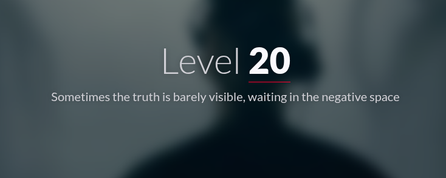
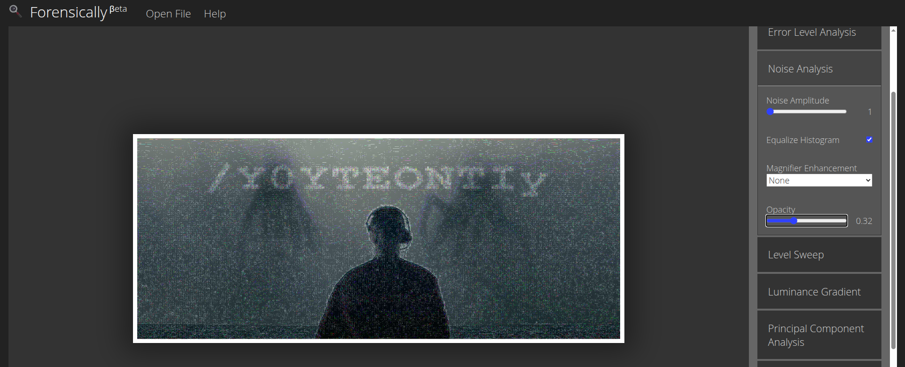

#  📌 Challenge Overview

| 🧩 Platform & Name | Arrival-VoorivexAcademy/lvl20 |
| ------------------- | ------------------------------- |
| 📅 Date             | 2025-10-19 |
| 👾 Solver           | Ph4nt01 |
| 🔰 Category         | forensic |
| ⭐ Difficulty        | easy |

---

# 📋 Initial Info:

### 

---

# 🔍 Initial Analysis:

### - based on the description of the site we can guess that the flag is in the background photo

---

# 🔓 Solving

### - so i downloaded the background photo `https://a.voorivex.academy/Y3MjE3OWZm/images/67.jpg`
### - then used this online tool([Forensically](https://29a.ch/photo-forensics/#forensic-magnifier)) to checkout the metadata and hidden details in the photo
### - after messing around with this tool's futures, i found the flag in the noise analysis section
### 

---

```markdown

🚩 Flag -> `/Y0YTEONTIy`

```

---
