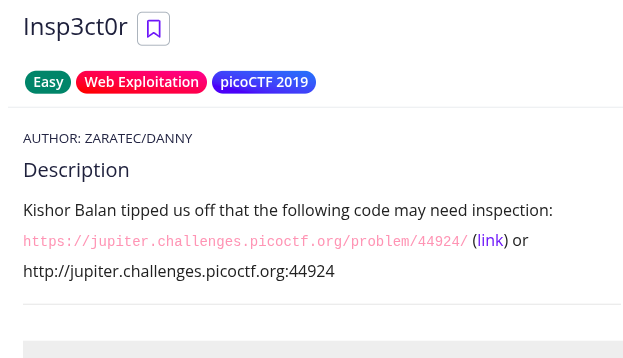
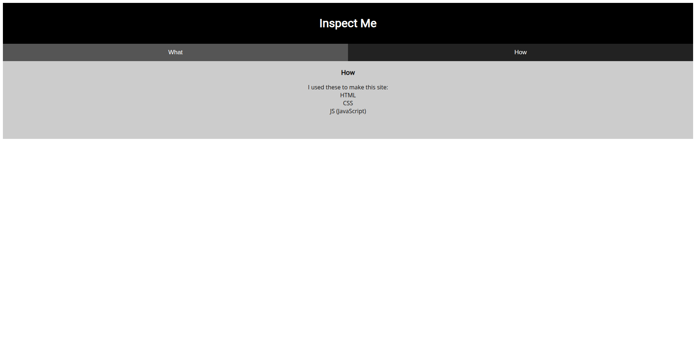
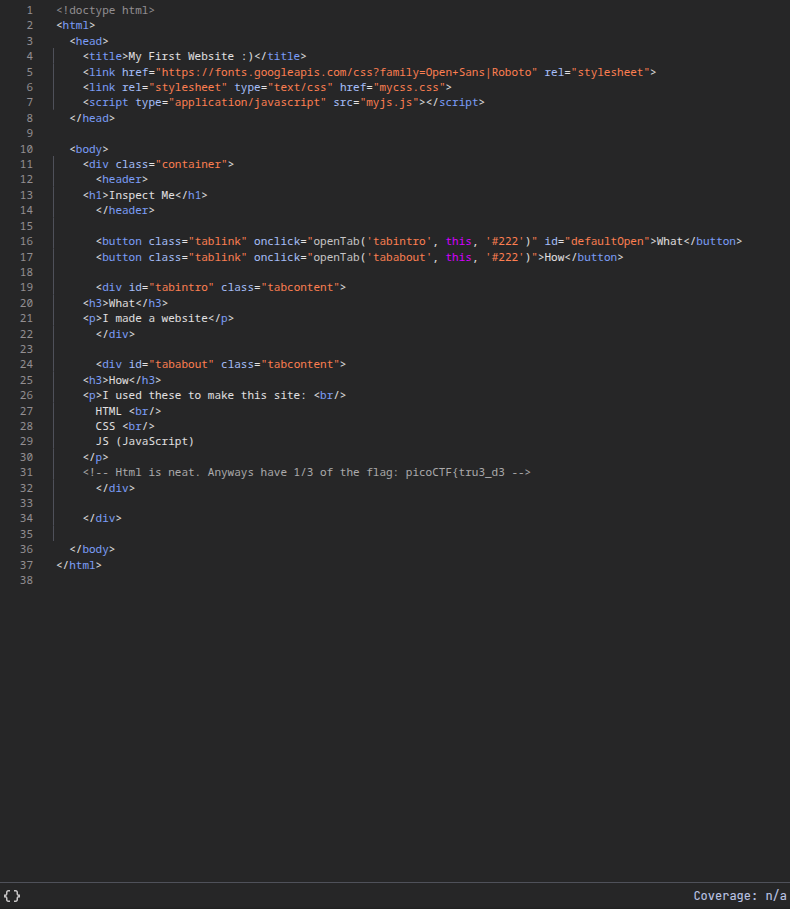
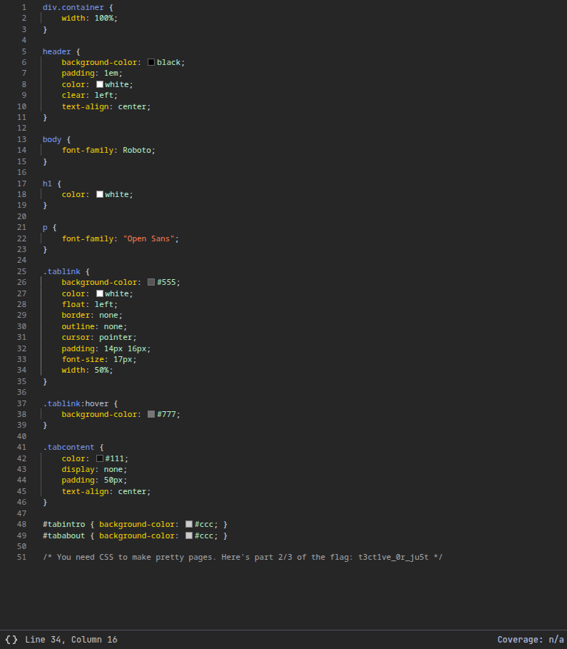
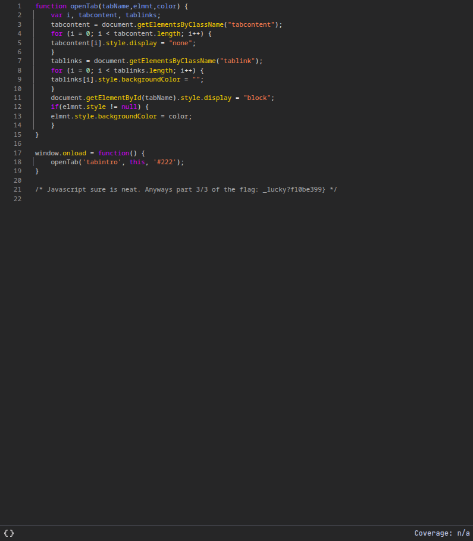

#  📌 Challenge Overview

| 🧩 Platform & Name | picoCTF/Insp3ct0r |
| ------------------- | ------------------------------- |
| 📅 Date             | 2025-08-24 |
| 👾 Solver           | Ph4nt01 |
| 🔰 Category         | Web |
| ⭐ Difficulty        | Easy |

---

# 📋 Initial Info:



---

# 🔍 Initial Analysis:




- the parts "I  used these to make this site: HTML CSS JS (JavaScript)" and "Inspect Me", made me think maybe i should inspect the website's HTML CSS JS:)

---

# ⚙️ Exploitation

- checked the HTML and found what seems to be the first part of the flag -> `picoCTF{tru3_d3`

  


- checked the CSS and found the second part -> `t3ct1ve_0r_ju5t`

  


- checked the JS and found the last part of the flag -> `_lucky?f10be399}`

  

---

```markdown

🚩 Flag -> `picoCTF{tru3_d3t3ct1ve_0r_ju5t_lucky?f10be399}`

```

---

# 📚 Takeaways

- when the website tells you to inspect, you probably should inspect.

---

