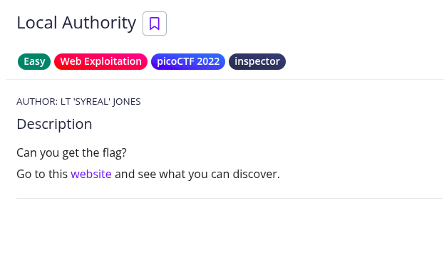
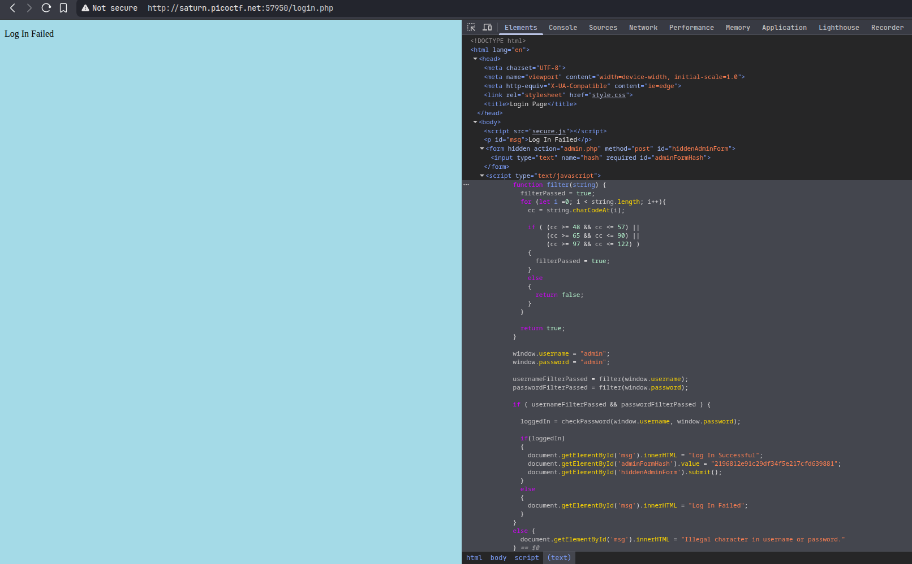
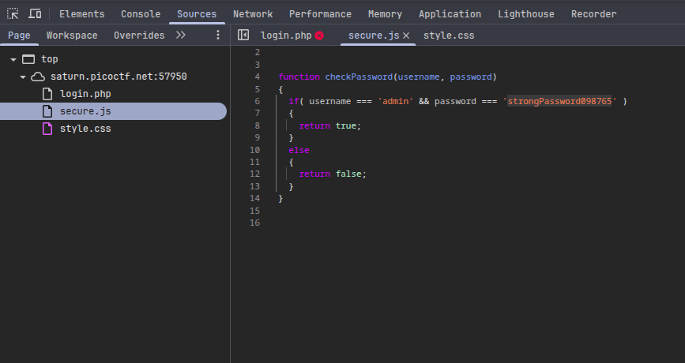
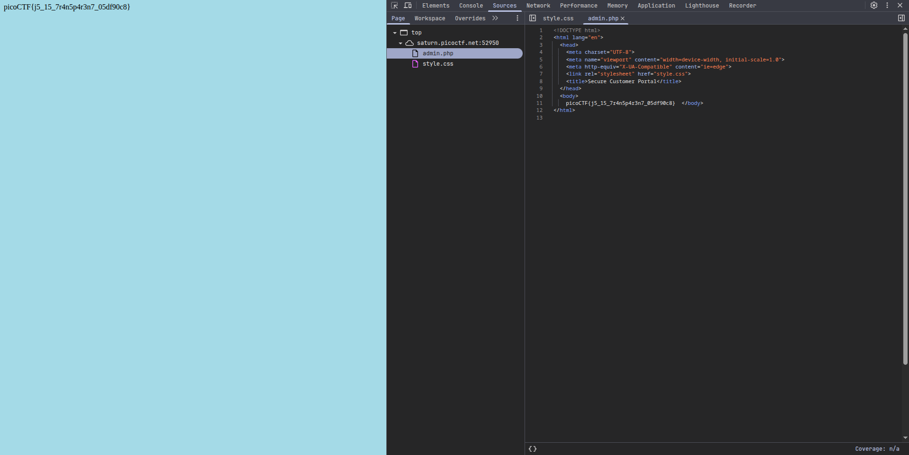

#  📌 Challenge Overview

| 🧩 Platform & Name | picoCTF/Local Authority |
| ------------------- | ------------------------------- |
| 📅 Date             | 2025-08-24 |
| 👾 Solver           | Ph4nt01 |
| 🔰 Category         | Web |
| ⭐ Difficulty        | Easy |

---

# 📋 Initial Info:

### 

---

# 🔍 Initial Analysis:

### - saw a login page, tried logging in with a random username and password, redirected me to `http://saturn.picoctf.net:57950/login.php` and said "Log In Failed"
### - inspected the web page
### 
### - found admin credentials in secure.js
### 

---

# 🔓 Solving:

### - tried the found creds, redirected me to `http://saturn.picoctf.net:52950/admin.php` and gave me the flag
### 

---

```markdown

🚩 Flag -> `picoCTF{j5_15_7r4n5p4r3n7_05df90c8}`

```

---

# 📚 Takeaways

### - maybe we should not put the admin credentials in secure.js :)

---

