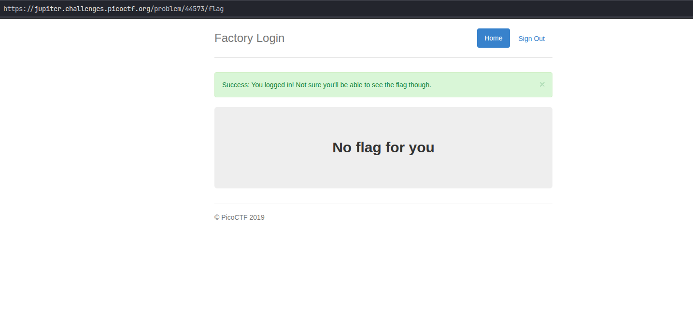
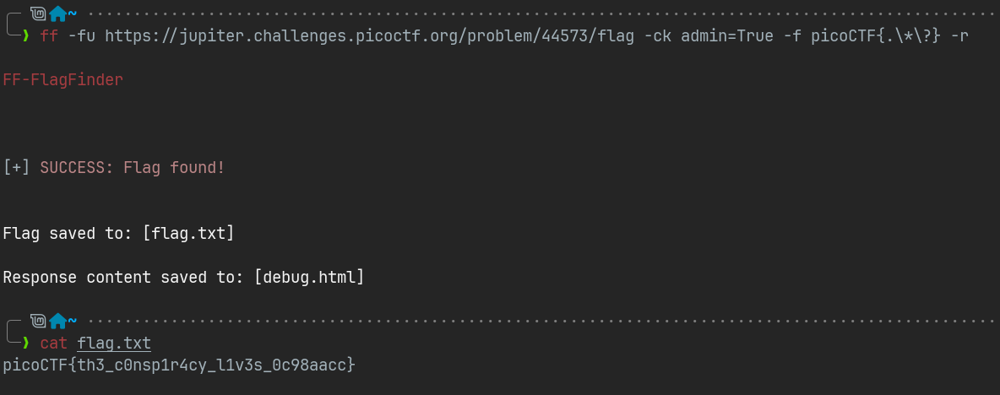
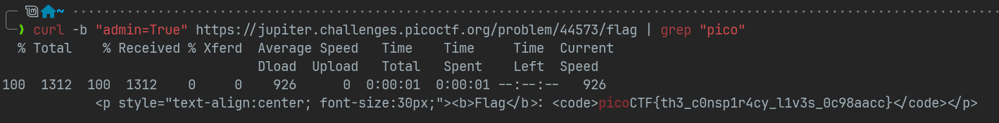

#  📌 Challenge Overview

| 🧩 Platform & Name | picoCTF/logon |
| ------------------ | ------------- |
| 📅 Date            | 2025-08-22    |
| 👾 Solver          | Ph4nt01       |
| 🔰 Category        | web           |
| ⭐ Difficulty       | easy          |

---

# 📋 Initial Info:


---

# 🔍 Initial Analysis:

- went to the URL

- saw a login page and tried signing in without inputing credentials

- redirected me to `https://jupiter.challenges.picoctf.org/problem/44573/flag`



- inspected DevTools and found a weird cookie in Application -> Cookies


---

# ⚙️ Exploitation

- now we know we should send a get request to the flag url with the cookie -> 'admin': 'True' to see some thing

- i did it via my [flagfinder](https://github.com/Ph4nt01/FF-FlagFinder) tool and found the flag
>The tool sends a get request (with specified headers or cookies) and downloads the response HTML -> then it runs re.findall(<pattern>, content) for finding a match for the flag regex.



- we could also use curl command



---
```markdown

🚩 Flag -> `picoCTF{th3_c0nsp1r4cy_l1v3s_0c98aacc}`

```
---

# 📚 Takeaways

- you could send a get request with specified cookies simply via running:
  `curl -b "cookie_name=cookie_value" https://example.com`
